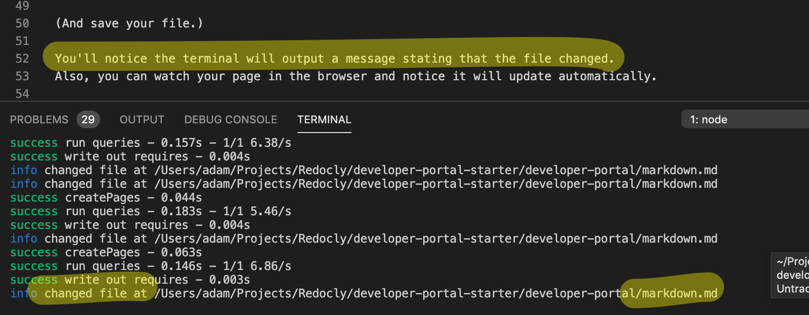

# H1

Body text.

## H2

Body text.

### H3

Body text.

Notice the URL in the address bar is localhost:3000/developer-portal/plain.
The file name maps to the URL path.

<embed src="./snippets/_snippet_test.md" />

[take me back to the markdown training exercise](markdown.md)